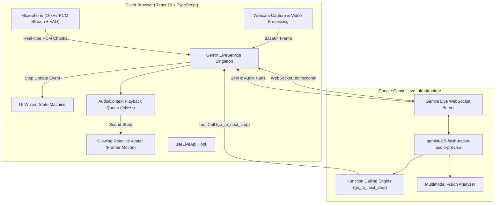

<div align="center">

# ✨ Evalyzer
### *Next-Generation Real-Time AI Skincare Consultant & Facial Diagnostic Platform*

[](https://react.dev/)
[](https://www.typescriptlang.org/)
[](https://vitejs.dev/)
[](https://tailwindcss.com/)
[](https://ai.google.dev/)
[](LICENSE)
[](CONTRIBUTING.md)

<br/>

<p align="center">
  <b>Evalyzer</b> bridges cutting-edge computer vision with low-latency bidirectional conversational AI. Powered by <b>Google's Gemini Live Multimodal API</b>, Evalyzer features <b>"Julia"</b> — an intelligent, empathetic virtual skincare expert that talks with users in natural conversational Arabic, analyzes facial features via live camera input, and autonomously guides users through a tailored skincare journey.
</p>

<p align="center">
  <a href="#-key-features">Key Features</a> •
  <a href="#-system-architecture">Architecture</a> •
  <a href="#-tech-stack">Tech Stack</a> •
  <a href="#-getting-started">Getting Started</a> •
  <a href="#-project-structure">Project Structure</a> •
  <a href="#-ui-showcase">UI Showcase</a> •
  <a href="#-license">License</a>
</p>

---

</div>

## 📌 Executive Summary

Modern skincare consultation often suffers from rigid static forms, disconnected surveys, and lack of visual context. **Evalyzer** transforms digital dermatology by combining **real-time bidirectional audio streaming** and **computer vision diagnostic intelligence** into a single cohesive web application.

Users don't just fill out a questionnaire; they have an organic, verbal consultation with an AI consultant (**Julia**). The AI watches, listens, replies conversationally, and **autonomously advances the UI** as the user answers questions verbally using Gemini Function Calling.

---

## 🌟 Key Features

### 🎙️ 1. Full-Duplex Low-Latency Audio Streaming
- **Native WebSocket Pipeline:** Direct bidirectional streaming to Gemini Live (`gemini-2.5-flash-native-audio-preview-12-2025`).
- **Real-Time PCM Processing:** Captures 16kHz microphone audio via the Web Audio API and streams it as raw PCM chunks.
- **High-Fidelity Audio Playback:** Decodes incoming 24kHz audio chunks and sequences them smoothly in an asynchronous playback queue.
- **Voice Activity Detection (VAD) & Instant Interruption:** Built-in RMS acoustic thresholding detects when the user begins speaking, immediately cutting off the AI's audio response for a natural conversational flow.

### 👁️ 2. Computer Vision Facial Diagnostics
- **Live In-Browser Camera Capture:** Accesses camera stream securely with frame preview and interactive capture triggers.
- **Multimodal Image Payload:** Encodes facial snapshots into JPEG/Base64 and feeds them directly into the ongoing Gemini Live session.
- **Clinical Skin Assessment:** Analyzes skin type (oily, dry, combination, normal), pores, acne conditions, dark circles, texture, and fine lines to guide subsequent consultation questions.

### ⚡ 3. Autonomous UI Navigation via Function Calling
- **Agentic Workflow:** The AI model is armed with declared tool functions (`go_to_next_step`).
- **Zero-Touch Progression:** After Julia asks a question and listens to the user's spoken answer, she acknowledges it and invokes `go_to_next_step` to programmatically slide the user interface to the next step without physical interaction.

### 🗣️ 4. Adaptive Conversational Tone & Dialect
- **Natural Egyptian Arabic:** Styled with warm, empathetic, and professional conversational phrasing.
- **Gender-Aware Grammar Adaptation:** Dynamically modifies system prompts based on whether the user identifies as male or female, guaranteeing grammatically accurate gendered verbs and adjectives.

### 🧴 5. Personalized Regimen & Product Recommendation
- **Tailored Skincare Regimen:** Matches diagnosed skin profiles to clinically formulated routines (e.g. Cleansers, Serums, Hydrators, Sunscreens).
- **Morning & Night Timeline:** Breaks down step-by-step usage rules (cleanse, application dosage, massage technique, moisturize).
- **Clinical Milestones Table:** Clear expectations showing timeline of visible results across Weeks 1 to 8.

### 📱 6. Omnichannel Mobile Handoff
- Quick phone number submission and dynamic QR code generation allowing users to take their customized regimen on-the-go on their mobile devices.

---

## 🏗️ System Architecture



---

## 🛠️ Tech Stack

| Domain | Technology | Description |
| :--- | :--- | :--- |
| **Frontend Core** | [React 19](https://react.dev/) & [TypeScript](https://www.typescriptlang.org/) | Next-gen component architecture and strict type safety |
| **Build & Tooling** | [Vite 7](https://vitejs.dev/) | Sub-second HMR and optimized production bundling |
| **Styling & System** | [Tailwind CSS v4](https://tailwindcss.com/) | Modern utility-first CSS engine with customized CSS variables |
| **Primitives & UI** | [Radix UI](https://www.radix-ui.com/) & [Lucide Icons](https://lucide.dev/) | Accessible headless primitives and modern icon set |
| **Animations** | [Framer Motion](https://www.framer.com/motion/) | Fluid physics-based state transitions and audio-reactive visuals |
| **AI Integration** | [@google/genai](https://www.npmjs.com/package/@google/genai) | Official Google Gen AI SDK for Gemini Live WebSockets |
| **Digital Signal** | Web Audio API | Custom `ScriptProcessorNode` audio pipeline, Float32 to Int16 PCM converter |
| **Routing** | [Wouter](https://github.com/molefrog/wouter) | Ultra-lightweight client-side routing |

---

## 🚀 Getting Started

### Prerequisites
- **Node.js** >= `18.0.0`
- **npm**, **pnpm**, or **yarn**
- Modern Chromium-based browser or Firefox with webcam & microphone permissions enabled
- A valid **Google Gemini API Key** with access to Gemini Live models ([Google AI Studio](https://aistudio.google.com/))

### Installation

1. **Clone the repository:**
   ```bash
   git clone https://github.com/Omar-0O/Evalyzer.git
   cd Evalyzer
   ```

2. **Install project dependencies:**
   ```bash
   npm install
   ```

3. **Configure Environment Variables:**
   Copy the `.env.example` template:
   ```bash
   cp .env.example .env
   ```
   Open `.env` and supply your Gemini API key:
   ```env
   VITE_GEMINI_API_KEY=AIzaSy...your_gemini_api_key_here
   ```

4. **Launch the development server:**
   ```bash
   npm run dev
   ```
   Navigate to `http://localhost:5173` and allow microphone and camera access.

5. **Build for Production:**
   ```bash
   npm run build
   ```

---

## 📂 Project Structure

```
Evalyzer/
├── Design/                    # Original UI/UX design mockups and screens
├── public/                    # Static assets, product imagery, QR codes
│   ├── products/              # Skincare product visuals
│   ├── ai-sphere.png          # Visual branding sphere
│   └── custom-qr.png          # Mobile handoff QR asset
├── src/
│   ├── components/            # Reusable React components
│   │   ├── skincare/          # Domain components:
│   │   │   ├── GradientAvatar.tsx   # Audio-reactive glowing avatar
│   │   │   ├── ProductCard.tsx      # Curated recommendation cards
│   │   │   ├── RoutineTable.tsx     # Structured clinical milestone table
│   │   │   ├── BottomNav.tsx        # Consultation progress indicator
│   │   │   └── TypewriterText.tsx   # Animated Arabic text typewriter
│   │   └── ui/                # Headless UI primitives (Radix UI wrappers)
│   ├── hooks/
│   │   ├── use-live-api.ts    # React custom hook binding Gemini Live singleton
│   │   └── use-toast.ts       # Toast notifications hook
│   ├── lib/
│   │   ├── gemini-live.ts     # Core service managing WebSockets, VAD, and tools
│   │   ├── audio-player.ts    # High-performance 24kHz PCM audio queue player
│   │   ├── audio-recorder.ts  # Audio streaming input helper
│   │   └── utils.ts           # Classnames merger and Tailwind utility helper
│   ├── pages/
│   │   ├── WelcomePage.tsx       # Onboarding stage with Julia's introduction
│   │   ├── GenderSelection.tsx   # Grammatical gender customization screen
│   │   ├── SkincareWizard.tsx    # Core engine: Camera scan, Q&A, Regimen & QR
│   │   ├── Home.tsx              # Stage coordinator
│   │   └── not-found.tsx         # 404 Fallback page
│   ├── App.tsx                # App root provider wrapper & routing
│   ├── index.css              # Design tokens, gradients, and custom scrollbars
│   └── main.tsx               # DOM entry point
├── .env.example               # Environment variables template
├── package.json               # Dependencies and build scripts
└── vite.config.ts             # Vite configuration with path aliases
```

---

## ⚙️ Gemini Live API Details

Evalyzer connects directly to Google's native real-time multimodal preview:
- **Model:** `gemini-2.5-flash-native-audio-preview-12-2025`
- **Response Modality:** `AUDIO`
- **Voice Preset:** `Kore`
- **Tool Declarations:**
  ```typescript
  const goToNextStepDeclaration = {
      name: 'go_to_next_step',
      description: 'Advance to the next question/step in the skincare wizard. Trigger immediately after responding to the user speech.',
      parameters: { type: Type.OBJECT, properties: {} }
  };
  ```

---

## 🖼️ UI Showcase

<div align="center">
  <table>
    <tr>
      <th align="center">Step 1: Welcome & Introduction</th>
      <th align="center">Step 2: Gender Adaptation</th>
    </tr>
    <tr>
      <td></td>
      <td></td>
    </tr>
    <tr>
      <th align="center">Step 3: Live Camera Face Scan</th>
      <th align="center">Step 4: Interactive Spoken Q&A</th>
    </tr>
    <tr>
      <td></td>
      <td></td>
    </tr>
    <tr>
      <th align="center">Step 5: Product Recommendations</th>
      <th align="center">Step 6: Clinical Routine & Expectations</th>
    </tr>
    <tr>
      <td></td>
      <td></td>
    </tr>
    <tr>
      <th align="center">Step 7: Regimen Confirmation</th>
      <th align="center">Step 8: Mobile Sync & QR Code</th>
    </tr>
    <tr>
      <td></td>
      <td></td>
    </tr>
  </table>
</div>

---

## 🤝 Contributing

Contributions, issues, and feature requests are welcome! Feel free to check out the [issues page](https://github.com/Omar-0O/Evalyzer/issues).

1. Fork the repository
2. Create your feature branch (`git checkout -b feature/AmazingFeature`)
3. Commit your changes (`git commit -m 'feat: add some AmazingFeature'`)
4. Push to the branch (`git push origin feature/AmazingFeature`)
5. Open a Pull Request

---

## 👨‍💻 Author & Maintainer

**Omar**
- GitHub: [@Omar-0O](https://github.com/Omar-0O)
- Email: [omar.nail774@gmail.com](mailto:omar.nail774@gmail.com)

---

## 📄 License

This project is licensed under the **MIT License** — see the [LICENSE](LICENSE) file for details.
